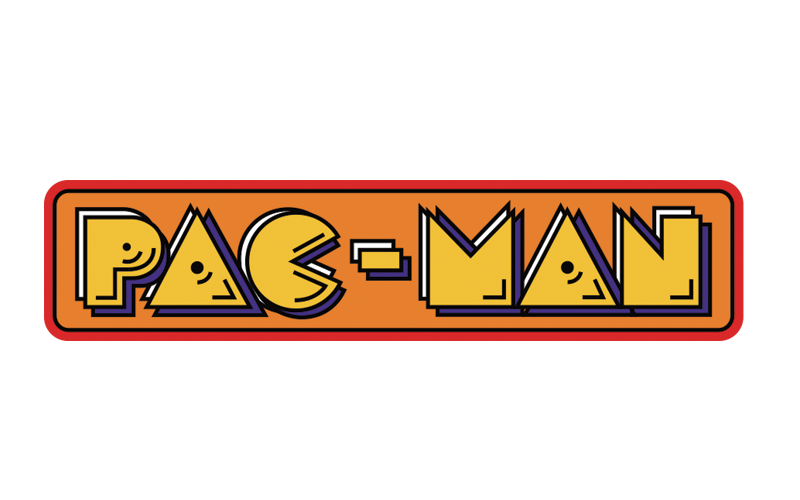

<!-- PROJECT LOGO -->

  

  

    This is my first project of <a href="https://www.ironhack.com/">Ironhack</a> Web development bootcamp
     
    <a href="https://github.com/AruaMonteiro/pacman-javascript-game"><strong>Explore the docs »</strong></a>
     
     
    <a href="https://aruamonteiro.github.io/pacman-javascript-game/">View Demo</a>
    ·
    <a href="https://github.com/AruaMonteiro/pacman-javascript-game/issues">Report Bug</a>
    ·
    <a href="https://github.com/AruaMonteiro/pacman-javascript-game/issues">Request Feature</a>
  

<!-- ABOUT THE PROJECT -->

## About The Project

[![Pacman Screenshot][product-screenshot]](https://aruamonteiro.github.io/pacman-javascript-game/)

A clone of the greatest arcade game of history!
I built this clone for my first project of <a href="https://www.ironhack.com/">Ironhack</a> Web development bootcamp.

### Built With

- Javascript
- HTML
- CSS

<!-- CONTACT -->

## Contact

Aruã Monteiro - aruamonteiro@gmail.com

Project Link: [https://github.com/AruaMonteiro/pacman-javascript-game](https://github.com/AruaMonteiro/pacman-javascript-game)

[product-screenshot]: images/game.png
